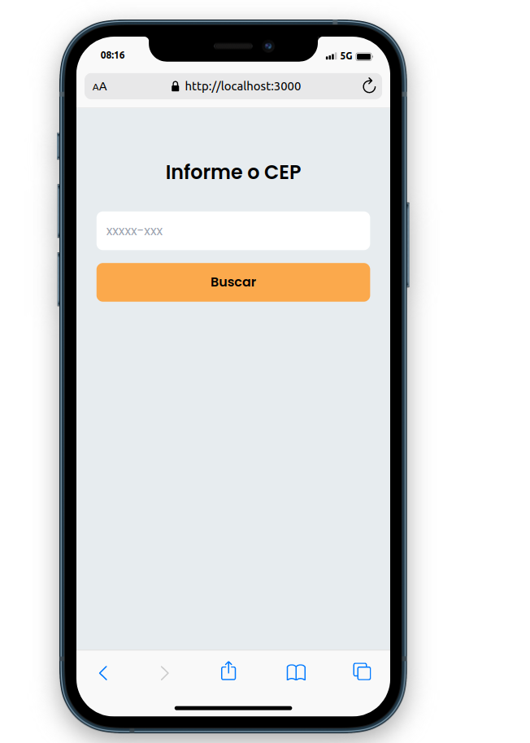

<h2>Desafio Teste da empresa Weonne</h2>

<h3>Apresentação do Projeto</h3>



<h3>Descrição</h3>

<p>Desenvolvimento de um sistema de busca de CEP.</p>

## :rocket: Tecnologias

- [React](https://pt-br.reactjs.org/)
- [HTML5](https://developer.mozilla.org/pt-BR/docs/Web/HTML/HTML5)
- [Tailwind CSS](https://tailwindcss.com/)

<div id="requisitos">

## :white_check_mark: Requisitos

<p>Antes de executar :checkered_flag:, você precisar ter o <a href="https://git-scm.com">[Git]</a> e o <a href="https://nodejs.org/pt-br/">[Node]</a> instalados.</p>

## :checkered_flag: Executando

```bash

# Clone este projeto
$ git clone https://github.com/guisantanaa/teste-vacancy-weonne

# Entre na pasta corebiz-ecommerce
$ cd teste-vacancy-weonne
$ Execute o comando 'code .' e o projeto sera aberto no Visual Studio Code

# Instale as dependências
$ yarn ou npm install

# Inicialize
$ yarn dev ou npm run dev

# Abra o seu navegador em http://localhost:3000

```

## :rocket: Declarando o componente dentro do interfaces.json

<p>Devemos importar o nosso componente a partir da pasta raiz do React. Segue o exemplo abaixo.</p>

```bash

import InputZipCode from './componentes/InputZipCode'

export default InputZipCode;

```

<p>No arquivo interfaces.json vamos precisar criar uma interface para o nosso componente. Segue o exemplo abaixo.</p>

```bash

{
  "input-zip-code": {
    "component": "InputZipCode"
  }
}

```

<p>O nosso input-zip-code é o nome da nossa nova interface, que irá renderizar o componente InputZipCode, que foi exportado a partir do root raiz do react.</p>

## :rocket: Chamando o componente dentro do block.json

<p>Acredito que seja possivel depois que já declaramos o componente no Interfaces.json, chamar o componente no block.json dentro de um children.</p>
